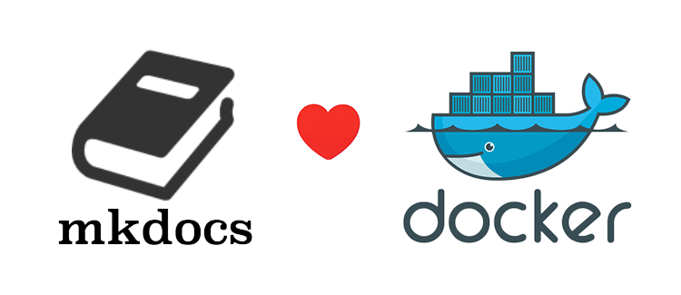

# Mkdocs Server

## Introduction

Mkdocs-server helps to run mkdocs without install python or anything.

## Usage

Go to your mkdocs project folder, then run this command.

	docker run -d --rm -p 8000:8000 -e UID=$(id -u) -e GID=$(id -g) -v $PWD:/mkdocs mnementh64/docker-mkdocs-serve

Thanks to [https://github.com/metal3d/docker-mkdocs](https://github.com/metal3d/docker-mkdocs) for his work.